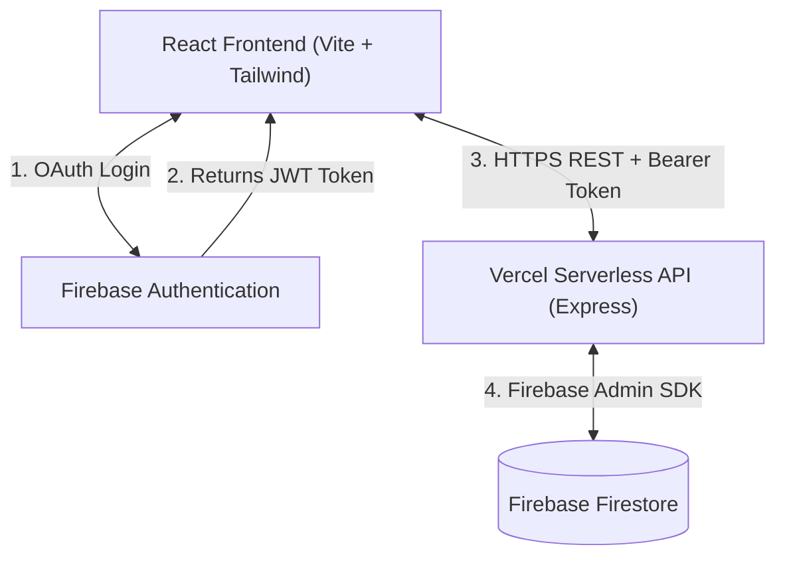
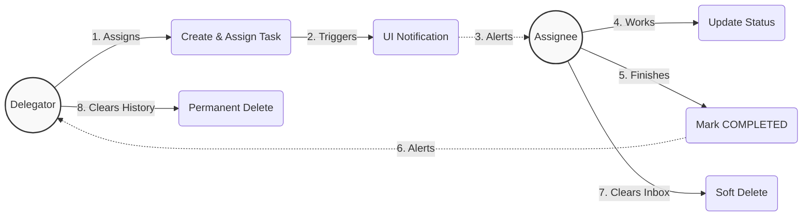

# Setup Instructions

**Deploy locally in under 5 minutes (Clone → Install → Run):**

1. **Clone the repository**

   ```bash
   git clone <repository-url>
   cd Assignly/my-app
   ```

2. **Set up Environment Variables**
   Create a `.env.local` file inside the `my-app` directory. This single file powers both your React frontend (`VITE_` keys) and the local Express backend (Admin SDK keys). Fill in your Firebase credentials:

   ```env
   # --- Frontend Firebase Config (Client SDK) ---
   VITE_FIREBASE_API_KEY="your-api-key"
   VITE_FIREBASE_AUTH_DOMAIN="your-auth-domain"
   VITE_FIREBASE_PROJECT_ID="your-project-id"
   VITE_FIREBASE_STORAGE_BUCKET="your-storage-bucket"
   VITE_FIREBASE_MESSAGING_SENDER_ID="your-sender-id"
   VITE_FIREBASE_APP_ID="your-app-id"

   # --- Backend Firebase Config (Admin SDK) ---
   FIREBASE_PROJECT_ID="your-project-id"
   FIREBASE_CLIENT_EMAIL="your-service-account-email"
   FIREBASE_PRIVATE_KEY="your-private-key-string-with-\n"
   ```

3. **Install Dependencies**

   ```bash
   npm install
   ```

4. **Run the Application**
   ```bash
   npm run dev
   ```
   _Your application will boot up at `http://localhost:5173`._

5. **(Optional) Seed the Database**
   To instantly populate your fresh Firestore database with a cluster of dummy tasks (so you don't have to manually create them one by one through the UI), simply run the seed script:
   ```bash
   node seed.js
   ```
   *Note: Open `seed.js` and modify the mock `delegatorEmail` and `assigneeEmail` to match your actual Google Auth emails if you want the tasks to visually appear on your specific dashboard.*

## Domain Testing (Vitest)
Assignly natively integrates `vitest` to rigorously test complex UI state derivations and business logic without needing to boot the full React DOM. You can run the test suite instantly via `npx vitest`.

**Example Unit Test (Rolling 7-Day Completion Window):**
```javascript
import { describe, it, expect } from 'vitest';
import { isCompletedThisWeek } from './taskUtils';

describe('isCompletedThisWeek', () => {
  it('returns true if the task was completed exactly today', () => {
    // Lock the moving "current time" to a static mock date
    const mockToday = new Date('2026-03-20T12:00:00Z');
    
    // Construct a mock Task payload representing an execution 2 hours prior
    const task = { status: 'COMPLETED', completedAt: '2026-03-20T10:00:00Z' };
    
    // Execute domain calculation
    expect(isCompletedThisWeek(task, mockToday)).toBe(true);
  });
});
```

## Assumptions and Trade-offs

1. **Serverless Infrastructure Latency:** Assignly's Express backbone is deployed to Vercel Serverless Functions. _Trade-off:_ We exchanged guaranteed sub-millisecond API response times (which a dedicated 24/7 server provides) for infinite, zero-maintenance scalability. This exposes users to occasional "cold starts" during prolonged inactivity.
2. **Client-Side Firebase Auth:** We completely delegated password/OAuth generation and hashing to the Firebase Client SDK directly in the browser instead of writing custom backend OAuth pipes. _Trade-off:_ We lose fine-grained control over session storage configurations, but we secure enterprise-grade cryptography immediately. The backend simply verifies the cryptographic signatures of the JWTs.
3. **NoSQL Denormalization:** By utilizing Firestore, we assumed read requests (frequent dashboard loads) will exponentially outnumber write requests (task creations). _Trade-off:_ We traded the absolute relational integrity of SQL (`JOIN` tables for permissions/assignments) for the raw vertical read speed of NoSQL documents.
4. **Soft-Delete Masking:** Realizing that a delegated task needs dual-visibility (if an assignee "deletes" a task, the delegator should still see it), we avoided building generic many-to-many permission tables. _Trade-off:_ We explicitly check assignment statuses manually inside the Node Express `DELETE` endpoint and convert the query into a soft `update({ deletedByAssignee: true })` mask if necessary, preferring rapid inline hacks over rigidly structured foreign constraint models.

---

## Architecture

Assignly utilizes a modern, serverless monorepo architecture engineered for high performance and zero-config cloud deployments.



### Application Flow (Use Case)


### Core Technologies

- **Frontend (Client):** React 18 powered by Vite. Styling is handled entirely via TailwindCSS for responsive, utility-first design. Routing is managed exclusively via React Router.
- **Backend (API):** A custom Node.js Express server running fully stateless on Vercel Serverless Functions (`api/index.js`).
- **Database:** Firebase Firestore (NoSQL Document Store) accessed natively through the Google Firebase Admin SDK within the Express routes.
- **Authentication:** Google OAuth natively handled by the Firebase Client SDK on the frontend. The resulting JWT tokens are securely passed as HTTP Bearer headers to the Express backend, which mathematically verifies them via the Admin SDK before mutating database states.

### 👨‍🍳 Chef's Kiss Features (UX Integrity)
1. **Protected Deletions:** Assignees are strictly prevented from deleting any task until they officially mark it as `COMPLETED`, ensuring active work cannot be accidentally erased.
2. **Dual-Visibility Soft Deletes:** If an assignee completes and deletes a task from their dashboard, it is *only* removed from their personal view. It permanently remains under the delegator's dashboard! This specifically prevents bad actors from falsely completing tasks and making them vanish without the creator's permission.
3. **Automated Urgency Triage:** If any assigned deadline falls within 3 days of the current date, the system autonomously intercepts the priority and permanently flags it as **Urgent**, pushing it to the illuminated dashboard highlight card.
4. **Comprehensive Event Tracking:** Delegators receive constant native UI notifications for everything—from the exact moment an assignee updates a task's status, to entirely detached events like a force-delegated user finally joining the platform and creating their Assignly account!

## Known Limitations & Future Improvements

**Current Limitations:**
1. **Stateless API Synchronization:** Because we pull data on-demand via Serverless Vercel endpoints rather than natively subscribing to full structural `onSnapshot` Firebase websockets directly on the client, data sync requires optimistic UI modifications or manual refresh/polling for complex background updates.
2. **Global Single-Tenant Scope:** Currently, the platform operates on a single global tier where delegates are matched purely via Google Auth Emails, preventing the creation of isolated, multi-tenant "Workspaces" or "Organizations" with centralized sub-administrators.
3. **No Native Background Pushing:** The current "Notifications" implementation only exists as a polling UI mechanism within the React application, rather than native mobile/desktop Background Push Notifications.

**Future Roadmap:**
1. **Firebase Cloud Messaging (FCM):** Integrate the FCM SDK and hardware service workers to send native push notifications to browsers and OS layers when a deadline goes "Urgent" or a task updates status.
2. **Organization Roles (RBAC):** Evolve the strict Email-To-Email assignment logic into a true multi-tenant Role-Based Access Control system (Admins, Managers, Assignees) clustered across distinct Company IDs.
3. **Websocket Native Subscriptions:** Refactor the dashboard data layer to stream real-time task mutations directly from Firestore to prevent any potential optimistic UI desyncs across multiple active browser tabs.
4. **Team Collaboration Pools:** Add a dedicated "Team" tab where people can invite specific members to a shared environment and post "open" tasks for anyone in the pool to claim.
5. **Make the UI faster:** Currently it takes a lot of time for the UI to load and fetch data of each user. Would like to improve the speed of this better.

---
## AI Tools
- **Google Stitch:** Leveraged to visually design and instantly prototype the sleek React UI components.
- **Antigravity:** Utilized as an agentic pair-programmer to assist with coding iterations, debugging real-time data flow issues, and structuring the Firebase endpoints and to make diagrams in README.
- **ChatGPT:** Used as a high-level advisor to help brainstorm and add any missing features in the architecture and system setup.

Link to Live Demo
https://worksync-self.vercel.app/


